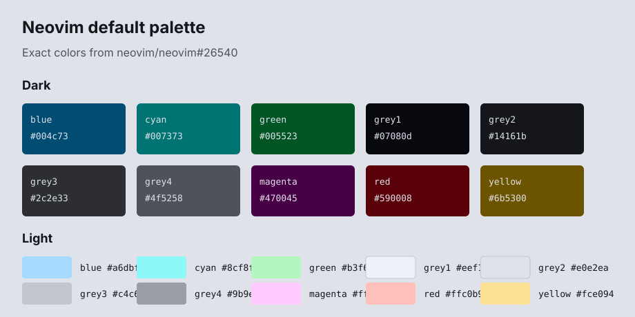

# neovim-default-extras

Neovim default color palette packaged as a single source of truth for generated terminal and multiplexer themes.

The palette tracks the default Neovim colorscheme from:

- [neovim/neovim#26334](https://github.com/neovim/neovim/pull/26334)
- [neovim/neovim#26540](https://github.com/neovim/neovim/pull/26540)

## Palette



The raw palette is stored in [palette.json](palette.json). Extras should use
the contrast-aware `themes.nvim-dark` and `themes.nvim-light` roles, not raw
`palette.dark` or `palette.light` colors directly.

### Dark

| Name | Hex | Use |
| --- | --- | --- |
| `blue` | `#004c73` | Identifiers and low-emphasis blue accents |
| `cyan` | `#007373` | Main syntax color, functions, info states |
| `green` | `#005523` | Strings, additions, success states |
| `grey1` | `#07080d` | Darkest background, floating surfaces |
| `grey2` | `#14161b` | Main dark background |
| `grey3` | `#2c2e33` | Cursor line and secondary surfaces |
| `grey4` | `#4f5258` | Visual selection and soft shadows |
| `magenta` | `#470045` | ANSI completeness, reserved accent |
| `red` | `#590008` | Errors and destructive states |
| `yellow` | `#6b5300` | Search and warning states |

### Light

| Name | Hex | Use |
| --- | --- | --- |
| `blue` | `#a6dbff` | Identifiers and low-emphasis blue accents |
| `cyan` | `#8cf8f7` | Main syntax color, functions, info states |
| `green` | `#b3f6c0` | Strings, additions, success states |
| `grey1` | `#eef1f8` | Lightest background, floating surfaces |
| `grey2` | `#e0e2ea` | Main light background |
| `grey3` | `#c4c6cd` | Cursor line and secondary surfaces |
| `grey4` | `#9b9ea4` | Visual selection and soft shadows |
| `magenta` | `#ffcaff` | ANSI completeness, reserved accent |
| `red` | `#ffc0b9` | Errors and destructive states |
| `yellow` | `#fce094` | Search and warning states |

## Extras

Committed extras:

- `extras/ghostty/nvim-dark.theme`
- `extras/ghostty/nvim-light.theme`
- `extras/kitty/nvim-dark.conf`
- `extras/kitty/nvim-light.conf`
- `extras/zellij/nvim-dark.kdl`
- `extras/zellij/nvim-light.kdl`

When adding an extra, keep the public theme name consistent: `nvim-dark` and `nvim-light`.

## Adding Extras

Use `palette.json` as the only source of truth. Do not hand-pick from
`palette.dark` or `palette.light`; those objects are raw palette constants.
Map target app keys to `themes.nvim-dark` and `themes.nvim-light`.

Keep generated files under `extras/<app>/`, commit both dark and light variants,
and validate with the strongest available parser or app config check.

Use greys for general UI structure and reserve hue for semantic meaning:

| Intent | Palette color |
| --- | --- |
| Main UI text/backgrounds | `grey*` |
| Comments and disabled text | darker foreground grey |
| Strings, additions, success | `green` |
| Functions, info, primary syntax | `cyan` |
| Errors, deletes, destructive actions | `red` |
| Warnings and search | `yellow` |
| Identifiers and subtle blue accents | `blue` |
| Reserved ANSI accent | `magenta` |

Prefer exact palette colors over derived shades. If an application needs colors beyond this palette, map the closest highlight-group intent first and document the exception.

For readable themes, dark-mode accents use the light palette values on dark
backgrounds; light-mode accents use the dark palette values on light
backgrounds.

## Zellij

Zellij extras should use the component-based theme spec, not the legacy
`fg`/`bg`/ANSI-like slot form. Use upstream built-in themes such as
[kanagawa.kdl](https://github.com/zellij-org/zellij/blob/main/zellij-utils/assets/themes/kanagawa.kdl)
as the structure reference.

`zellij setup --check` validates syntax only. It does not prove readable
contrast in the status bar, tab bar, pane frames, or key hints. For visual
validation, run
[imsnif/theme-tester](https://github.com/imsnif/theme-tester) inside a Zellij
session:

```sh
zellij plugin -f -- https://github.com/imsnif/theme-tester/releases/latest/download/theme-tester.wasm
```

Check key hint letters, selected/unselected tabs, pane frame labels, mode
ribbons, and plugin UI states.

## License

MIT. See [LICENSE](LICENSE).
